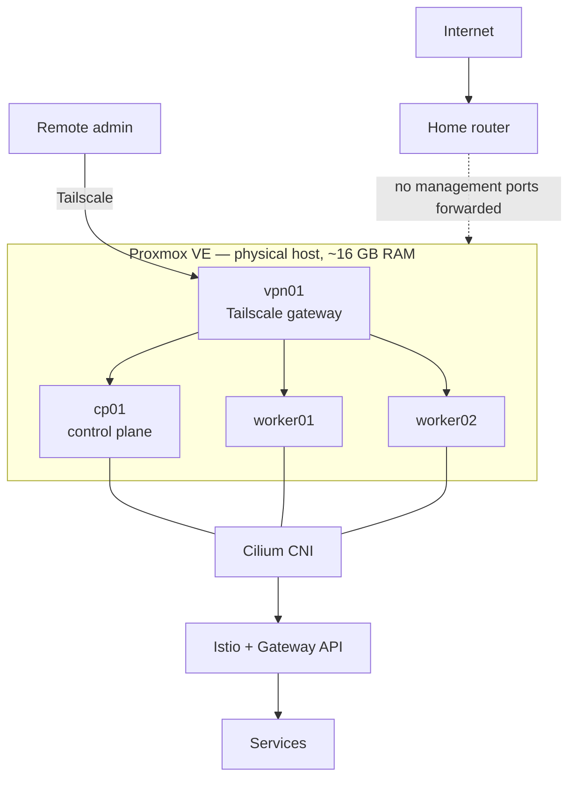

# homelab

[](https://github.com/devdanielgherasim/homelab/actions/workflows/validate.yml)
[](https://github.com/devdanielgherasim/homelab/actions/workflows/security.yml)
[](LICENSE)

A production-style Kubernetes homelab, built on a single Proxmox host, as a
DevOps / Platform Engineering learning project and portfolio reference.
Everything is declared in Git: Proxmox host configuration and VM provisioning
are code, and the cluster is bootstrapped by Ansible.

> **Status: infrastructure layer deployed, platform layer in progress.** The
> Proxmox host, four hardened VMs and a 3-node upstream Kubernetes cluster
> are running; the CNI (Cilium), ingress, GitOps and observability are next.
> [`STATUS.md`](STATUS.md) is the authoritative, component-by-component
> record — the diagram below is the **target** architecture.

## What is built today

| Layer | State | Where |
|---|---|---|
| Proxmox VE host: firewall, key-only SSH, least-privilege API token | Deployed | [`ansible/roles/proxmox_bootstrap`](ansible/roles/proxmox_bootstrap) |
| Ubuntu 24.04 cloud-init template | Deployed | [`ansible/roles/proxmox_template`](ansible/roles/proxmox_template) |
| 4 VMs (`vpn01`, `cp01`, `worker01`, `worker02`) | Deployed | [`tofu/`](tofu) |
| Guest hardening (SSH, unattended upgrades) | Deployed | [`ansible/roles/guest_hardening`](ansible/roles/guest_hardening) |
| Kubernetes control plane + 2 workers (kubeadm, containerd) | Deployed — nodes `NotReady` until the CNI lands | [`ansible/roles/kubeadm_*`](ansible/roles) |
| Cilium, Tailscale, MetalLB, Istio, Argo CD, Kyverno, observability | Planned | [`STATUS.md`](STATUS.md) |

Real incidents hit and fixed along the way are written up in
[`docs/troubleshooting/`](docs/troubleshooting/).

## Why this exists

To build and operate, hands-on, the full stack a Platform Engineer is
expected to know — virtualization, upstream Kubernetes internals,
networking/service mesh, GitOps delivery, observability, and security —
on real (if small) hardware, at zero recurring cost, with everything
reproducible from this Git repository.

## Target architecture



Full design: [`docs/architecture/overview.md`](docs/architecture/overview.md)
and the rest of [`docs/architecture/`](docs/architecture/).

## Technology stack

| Layer | Tools |
|---|---|
| Virtualization | Proxmox VE, Ubuntu Server 24.04 LTS guests |
| IaC | OpenTofu, Ansible |
| Kubernetes | kubeadm, containerd |
| Networking | Cilium, Hubble, MetalLB |
| Traffic | Istio, Kubernetes Gateway API |
| GitOps | Argo CD |
| CI | GitHub Actions (GitHub-hosted for all public/untrusted validation) |
| Security | Tailscale, SSH Ed25519, SOPS + age (pending review), Kyverno, Trivy, gitleaks |
| Observability | Prometheus, Grafana, Loki, Tempo, Hubble |

Rationale for each major choice is recorded as an ADR — see
[`docs/adr/`](docs/adr/).

## Repository structure

```text
├── AGENTS.md              # normative rules for any AI agent working here
├── CLAUDE.md               # Claude Code-specific routing on top of AGENTS.md
├── STATUS.md                # what's PLANNED / IMPLEMENTED / VALIDATED / DEPLOYED
├── Makefile                  # make help / doctor / fmt / lint / validate / security
├── mise.toml                  # pinned local tool versions
├── tofu/                       # Proxmox VM/infrastructure resources (OpenTofu)
├── ansible/                     # Proxmox host + guest OS + Kubernetes bootstrap
├── kubernetes/                   # bootstrap / platform / apps manifests (Argo CD-managed)
├── docs/
│   ├── architecture/               # design, one doc per domain
│   ├── proxmox/                     # manual-install doc + responsibility model
│   ├── security/                     # public-repo threat model, runner trust boundary
│   ├── adr/                           # architecture decision records
│   ├── runbooks/ troubleshooting/      # operational knowledge (from real incidents)
│   └── contributing/                    # dev workflow, AI-collaboration guide
├── .claude/                                # agents, skills, hooks (see below)
└── .github/                                 # CI, issue/PR templates
```

## Quick start (for contributors)

```bash
# Ansible and Makefile targets need WSL2/Linux/macOS — see
# docs/contributing/development-workflow.md
git clone https://github.com/devdanielgherasim/homelab.git
cd homelab
mise install       # pinned tool versions from mise.toml
make doctor         # reports what's present/missing — installs nothing
make validate         # change-aware static validation
```

Operating against real infrastructure needs a private inventory and
credentials that are never committed — see
[`docs/proxmox/installation.md`](docs/proxmox/installation.md) for the manual
starting point and the responsibility model, and
[`ansible/README.md`](ansible/README.md) / [`tofu/README.md`](tofu/README.md)
for the run order.

## Current status

See [`STATUS.md`](STATUS.md) for the full table and the known deviations
from the target design (for example: the VMs currently share one flat network,
and the VPN gateway is not configured yet).

## Roadmap

9-phase build plan (Foundation → Remote access → Kubernetes bootstrap →
Cluster networking → Service exposure → GitOps → Security controls →
Observability → Automation) — see
[`docs/architecture/overview.md`](docs/architecture/overview.md#6-implementation-roadmap).
Next milestone: [`STATUS.md`](STATUS.md#next-milestone).

## Security philosophy

This repository is public — everything committed is written assuming it
will be read by strangers. Real credentials and real home-network identity
never get committed, encrypted or not, without a reviewed reason. A
self-hosted GitHub Actions runner inside the homelab is planned but is
treated as privileged infrastructure: untrusted PR code never reaches it.
Full policy: [`docs/security/public-repository.md`](docs/security/public-repository.md)
and [`docs/security/self-hosted-runners.md`](docs/security/self-hosted-runners.md).

## Automation philosophy

Git is the source of truth, not any AI conversation. Manual configuration
stops the moment automation can reach a target — see
[`docs/proxmox/installation.md`](docs/proxmox/installation.md) for exactly
where the manual/automated line sits. Destructive operations
(`tofu apply`/`destroy`, `kubectl apply`/`delete`, credential rotation,
etc.) always require explicit human approval — see
[`AGENTS.md`](AGENTS.md#destructive-action-policy).

## AI-assisted development

Built collaboratively with Claude Code, Codex, ChatGPT, and Perplexity —
see [`AGENTS.md`](AGENTS.md) (normative, provider-neutral rules),
[`CLAUDE.md`](CLAUDE.md) (Claude Code routing), and
[`docs/contributing/ai-collaboration.md`](docs/contributing/ai-collaboration.md)
(using ChatGPT/Perplexity without losing Git as source of truth).

## Documentation

Start at [`docs/README.md`](docs/README.md) — a task-to-document index,
not a directory to read end-to-end.

## License

[MIT](LICENSE)
