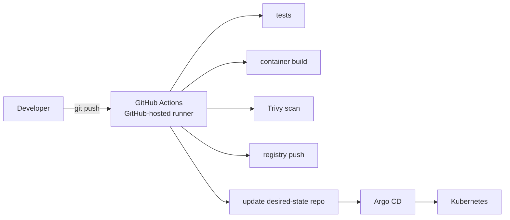

# GitOps

Status: design reference — see [`STATUS.md`](../../STATUS.md).

## Delivery pipeline

CI (build/test/scan/publish) always runs on GitHub-hosted runners,
regardless of trust level of the change — see
[`../security/self-hosted-runners.md`](../security/self-hosted-runners.md)
for why homelab-privileged operations are a separate, restricted path.

## Argo CD

Continuous reconciliation of platform and application desired state.
Application manifests under `kubernetes/platform/` and `kubernetes/apps/`
are the source of truth Argo CD reconciles against — Git, not any AI
conversation or manual `kubectl` change, is authoritative for cluster
state (see [`AGENTS.md`](../../AGENTS.md)).

## Source of truth boundary

- **In Git:** desired state (manifests, Helm values, Kustomize overlays), ADRs, docs.
- **Not in Git:** actual runtime state, which Argo CD reconciles *from* Git, never the reverse — manual cluster drift is corrected by re-syncing, not by exporting live state back into the repo.

## Infrastructure vs. platform boundary

OpenTofu/Ansible own everything up through a bootstrapped Kubernetes API
(VMs, OS, kubeadm init). Everything above that — CNI, ingress, platform
services, applications — is Argo CD's responsibility once bootstrap
manifests are applied once to install Argo CD itself. See
[`infrastructure.md`](infrastructure.md) for the provisioning side.
