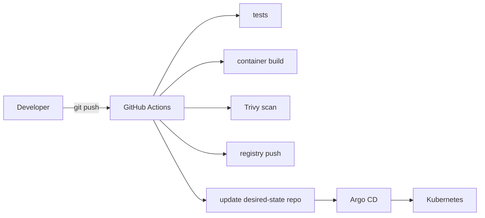

# Infrastructure

Status: design reference — see [`STATUS.md`](../../STATUS.md).

## Compute and memory allocation

16 GB RAM is the hard ceiling. Allocations are deliberately conservative.

| VM / host | vCPU | RAM | Disk | Role |
|---|---|---|---|---|
| Proxmox host | host | ~2 GB reserved | — | Hypervisor and management |
| `vpn01` | 1 | 512 MB – 1 GB | 16 GB | VPN gateway / bastion / subnet router |
| `cp01` | 2 | 2.5–3 GB | 32 GB | Kubernetes control plane + etcd |
| `worker01` | 2 | 3–3.5 GB | 64 GB | Application/platform workloads |
| `worker02` | 2 | 3–3.5 GB | 64 GB | Application/platform workloads |
| Headroom | — | ~3–4 GB | ~320 GB | Filesystem cache, bursts, temporary workloads, VM template, backups |

Disk figures assume the 500 GB SSD; generous relative to RAM since disk
is the less contended resource here. Sized as the OpenTofu module's
defaults (`tofu/modules/proxmox-vm/`) — adjust both together if changed.

Observability retention must stay short (see
[`observability.md`](observability.md)) to avoid memory and disk pressure.
Additional control-plane nodes can be created temporarily for HA/quorum
exercises, then removed.

## Provisioning approach

OpenTofu provisions Proxmox VMs from an Ubuntu 24.04 template (`tofu/`);
Ansible configures Linux, packages, and Kubernetes node prerequisites
(`ansible/`). Cluster and platform configuration then transitions to
GitOps (Argo CD) after bootstrap — see [`gitops.md`](gitops.md).



Neither OpenTofu nor Ansible runs against the real Proxmox host from CI or
from a hook without explicit human action — see the destructive-action
policy in [`../../AGENTS.md`](../../AGENTS.md).

## Repository layout for this domain

```text
tofu/          # Proxmox VM provisioning
├── modules/   # reusable OpenTofu modules
└── environments/

ansible/       # guest OS + Kubernetes prerequisites
├── inventories/
├── playbooks/
└── roles/
```

Both directories are implemented and applied against the real host — see
[`STATUS.md`](../../STATUS.md) for per-component state and
[`../../tofu/README.md`](../../tofu/README.md) /
[`../../ansible/README.md`](../../ansible/README.md) for usage.

## Backup, recovery, and failure testing

- Create periodic Proxmox VM backups/snapshots before invasive platform changes.
- Take regular etcd snapshots and document a restore procedure (as a runbook — see [`../runbooks/README.md`](../runbooks/README.md)).
- Keep desired state in Git so Argo CD can reconstruct workloads after cluster recovery.
- Back up persistent application data independently from VM snapshots when data durability matters.
- Test restore procedures; a backup that has never been restored is unverified.

### Failure scenarios to practice

| Scenario | Expected learning |
|---|---|
| Worker `NotReady` | kubelet/containerd/systemd diagnosis; scheduling impact |
| CNI failure | Pod routing, Cilium health, connectivity debugging |
| DNS failure | CoreDNS/service discovery troubleshooting |
| Broken Gateway route | Gateway API/Istio route and certificate diagnostics |
| NetworkPolicy denial | Hubble flows and least-privilege policy debugging |
| OOMKilled workload | Requests/limits, JVM/container memory, kernel signals |
| PVC failure | Storage lifecycle and recovery |
| Control-plane loss | etcd snapshot and kubeadm recovery concepts |

Each practiced scenario should produce a `docs/troubleshooting/` entry.
