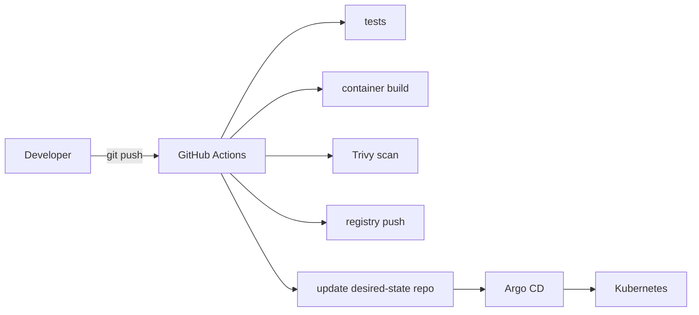

# Infrastructure

Status: design reference — see [`STATUS.md`](../../STATUS.md).

## Compute and memory allocation

Each Proxmox host has its own RAM ceiling: 16 GB on the first (`pve01`, the laptop) and 8 GB on the second (`pve02`, [ADR-0020](../adr/0020-second-standalone-proxmox-node.md)). Allocations are deliberately conservative. The table below is per host: `vpn01`, `cp01` and `worker01` on `pve01`, `worker02` on `pve02`.

| VM / host | vCPU | RAM | Disk | Role |
|---|---|---|---|---|
| Proxmox host | host | ~2 GB reserved | — | Hypervisor and management |
| `vpn01` | 1 | 512 MB – 1 GB | 16 GB | VPN gateway / bastion / subnet router |
| `cp01` | 2 | 6 GB (was 4, and 3 before) | 32 GB | Kubernetes control plane + etcd |
| `worker01` | 2 | 3–3.5 GB | 64 GB | Application/platform workloads |
| `worker02` (second Proxmox node) | 3 | 5.5 GB | 64 GB | Application/platform workloads; runs on `pve02`, which has its own 8 GB |
| Headroom | — | ~3.4 GB on `pve01`, ~0.4 GB on `pve02` | ~320 GB | Filesystem cache, bursts, temporary workloads, VM template, backups |

`cp01` was raised from 3 GB to 4 GB on 2026-09-20: with the platform running it used 2.3 of
2.9 GiB (80%), `kube-apiserver` alone about 1.3 GiB. The host showed 15.9 GB total, 3.1 GB
available and 12.8 GB used before the change, with 11.3 GB configured for the VMs; the extra
gigabyte leaves about 2 GB for the host, so the next increase has to come from somewhere else
(a smaller worker, or another machine). The VMs have no balloon and no memory hotplug, so a
change needs the VM to be stopped and started.

Applied the same day: `tofu apply` changed the configuration (the memory showed as pending in
Proxmox and nothing restarted), then `cp01` was shut down cleanly through the guest agent (8 s)
and started again. The API server was unavailable for about 50 seconds, not the several minutes
that had been expected. Afterwards the node has 3.9 GB, uses 64% instead of 80%, and the API
server still holds about 1.2 GiB right after a fresh start (heap in use 1.1 GiB, with 48
CRDs installed), so that figure is its baseline and not something that accumulated. Pods that
need the API server restarted while it was down (kube-state-metrics four times, CoreDNS, the
Cilium operator, the certificate approver, the Argo CD repo server); nothing was lost and every
Prometheus target was back within two minutes.

Raised again the same day, from 4 GB to 6 GB, once Kyverno had taken it to 74% (see
[ADR-0019](../adr/0019-kyverno-admission-policy.md)) and `worker02` had been moved to the second
Proxmox node (ADR-0020), which freed the memory on the first host. Same procedure: the plan
showed one in-place change (`4096 -> 6144`), the apply left the memory pending in Proxmox, and `cp01`
was shut down through the guest agent and started again. The API server was unavailable for 46
seconds, all 17 Argo CD Applications were `Synced/Healthy` and no pod was left not running
afterwards. Measured after the restart: 5.9 GB in the VM, 2.3 GB used and 3.6 GB available, with
`kube-apiserver` at about 1.4 GiB resident right after its fresh start. That leaves the control plane
at about 33% by the metrics API against 74% before (right after a fresh start, so it will grow
back towards the earlier working set; measure again after a day), so the Trivy operator and further CRD-heavy
components can be weighed again (ADR-0019). `pve01` keeps about 3.2 GB free after the change.

Disk figures assume the 500 GB SSD; generous relative to RAM since disk
is the less contended resource here. Sized as the OpenTofu module's
defaults (`tofu/modules/proxmox-vm/`) — adjust both together if changed.

Observability retention must stay short (see
[`observability.md`](observability.md)) to avoid memory and disk pressure.
Additional control-plane nodes can be created temporarily for HA/quorum
exercises, then removed.

## Provisioning approach

OpenTofu provisions Proxmox VMs from an Ubuntu 24.04 template (`tofu/`);
Ansible configures Linux, packages, and Kubernetes node prerequisites
(`ansible/`). Cluster and platform configuration then transitions to
GitOps (Argo CD) after bootstrap — see [`gitops.md`](gitops.md).



Neither OpenTofu nor Ansible runs against the real Proxmox host from CI or
from a hook without explicit human action — see the destructive-action
policy in [`../../AGENTS.md`](../../AGENTS.md).

## Repository layout for this domain

```text
tofu/          # Proxmox VM provisioning
├── modules/   # reusable OpenTofu modules
└── environments/

ansible/       # guest OS + Kubernetes prerequisites
├── inventories/
├── playbooks/
└── roles/
```

Both directories are implemented and applied against the real host — see
[`STATUS.md`](../../STATUS.md) for per-component state and
[`../../tofu/README.md`](../../tofu/README.md) /
[`../../ansible/README.md`](../../ansible/README.md) for usage.

## Backup, recovery, and failure testing

- Create periodic Proxmox VM backups/snapshots before invasive platform changes.
- Take regular etcd snapshots and document a restore procedure (as a runbook — see [`../runbooks/README.md`](../runbooks/README.md)).
- Keep desired state in Git so Argo CD can reconstruct workloads after cluster recovery.
- Back up persistent application data independently from VM snapshots when data durability matters.
- Test restore procedures; a backup that has never been restored is unverified.

### Failure scenarios to practice

| Scenario | Expected learning |
|---|---|
| Worker `NotReady` | kubelet/containerd/systemd diagnosis; scheduling impact |
| CNI failure | Pod routing, Cilium health, connectivity debugging |
| DNS failure | CoreDNS/service discovery troubleshooting |
| Broken Gateway route | Gateway API/Istio route and certificate diagnostics |
| NetworkPolicy denial | Hubble flows and least-privilege policy debugging |
| OOMKilled workload | Requests/limits, JVM/container memory, kernel signals |
| PVC failure | Storage lifecycle and recovery |
| Control-plane loss | etcd snapshot and kubeadm recovery concepts |

Each practiced scenario should produce a `docs/troubleshooting/` entry.
