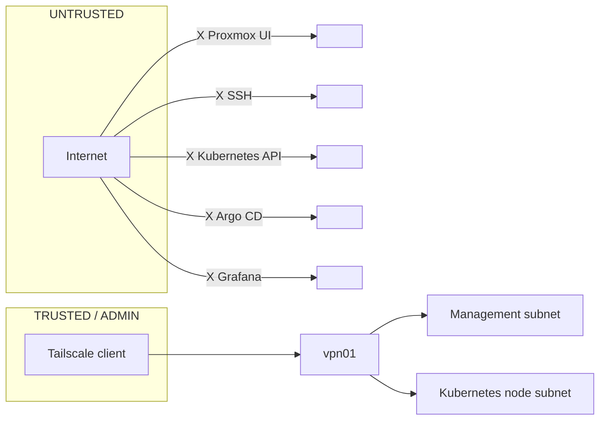
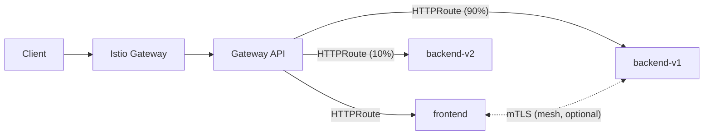

# Networking

Status: design reference — see [`STATUS.md`](../../STATUS.md).

## Public-repository note

Real household network identifiers (ISP, public IP/DDNS, router make and
model, real LAN CIDR, device MAC addresses) are **intentionally not
published** in this repository — see
[`../security/public-repository.md`](../security/public-repository.md).
Wherever an example address is needed below, a documentation range
(RFC 1918 for private planning ranges the lab actually uses, RFC 5737 where
a "public-facing" example is needed) is used. Real values, when they exist,
live in a local file excluded by `.gitignore` (`local/`).

## Addressing plan

| Network | Planning CIDR | Purpose |
|---|---|---|
| Home LAN | *(existing household network — not published; see `local/` override)* | Router NAT and general household connectivity |
| Management | `10.10.10.0/24` | Proxmox management and administrative services |
| Kubernetes nodes | `10.10.20.0/24` | Control-plane and worker node addresses |
| LoadBalancer pool | `10.10.30.0/24` | Addresses assigned to LoadBalancer services / Istio Gateway |
| Pod CIDR | `10.244.0.0/16` | Kubernetes pod addresses |
| Service CIDR | `10.96.0.0/12` | Kubernetes ClusterIP virtual services |

Final subnets must be validated against the actual home LAN before
implementation to avoid overlap — done locally, not in this document.

## Current state versus this design

Not yet implemented: all four VMs currently share one flat network with the
household LAN, and Tailscale is not configured. The reasoning and the exit
condition are recorded in
[ADR-0009](../adr/0009-flat-network-until-vpn.md); the live deviations are
listed in [`STATUS.md`](../../STATUS.md#known-deviations-from-the-target-design).

## Trust boundaries

The router must not forward management ports from WAN. External
application publishing, if ever added, is a separate security project with
explicit TLS, authentication, rate limiting, and exposure review — not an
extension of the management-plane trust boundary.

## Remote access and VPN

A dedicated `vpn01` VM is the remote-access boundary. Tailscale provides an
encrypted WireGuard-based overlay; `vpn01` advertises only the approved
private subnets. Administrative endpoints stay bound to private addresses.

- Require MFA on the identity used for Tailscale.
- Use device approval and ACLs/tags rather than broad all-to-all access.
- Do not install public-facing SSH or expose the Proxmox UI through router
  port forwarding.
- Use SSH Ed25519 keys; disable SSH password authentication and direct
  root login on guest VMs.
- For Wake-on-LAN from outside the home, use a small always-on trusted
  device or router capability to emit the local magic packet — not a
  WAN-exposed service.

## Kubernetes traffic path

Istio features to exercise: mTLS, weighted routing/canary deployment,
timeouts, retries, circuit-breaking, telemetry, authorization policies.
See [`kubernetes.md`](kubernetes.md) for Cilium/Istio implementation detail.
