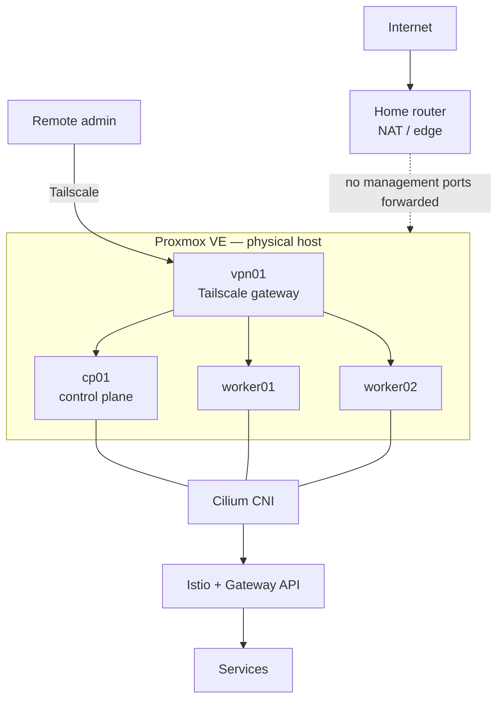

# Architecture Overview

Status: design reference. See [`STATUS.md`](../../STATUS.md) for what is
actually built. Ported and restructured from the original design document
(`docs/homelab-architecture.docx`, v1.0, Sept 2026); sanitized per
[`../security/public-repository.md`](../security/public-repository.md) —
real home-network identifiers were removed, not just this file's copy.

## 1. Executive summary

A secure, production-like homelab built on a single repurposed laptop
(~16 GB RAM), designed primarily for DevOps, Platform Engineering, and SRE
learning at zero recurring software cost. The design favors transparent,
industry-standard building blocks (upstream Kubernetes via `kubeadm`, not a
simplified local-dev distribution) over convenience.

| Area | Decision |
|---|---|
| Hypervisor | Proxmox VE, installed directly on the laptop |
| Kubernetes | Upstream Kubernetes, bootstrapped with `kubeadm` |
| Networking | Cilium CNI; isolated management and cluster networks |
| North-south traffic | Istio implementing the Kubernetes Gateway API |
| Remote access | Tailscale VPN through a dedicated gateway/bastion VM |
| Delivery | GitHub Actions for CI, Argo CD for GitOps/CD |
| Security | VPN-only management, default-deny firewall/policies, SSH keys, SOPS+age, Kyverno, Trivy |
| Observability | Prometheus, Grafana, Loki, Tempo, Cilium Hubble |
| Availability goal | Learning-grade resilience — not true HA; the physical laptop is a single point of failure |

## 2. Architecture principles

- No administrative service is exposed directly to the public Internet.
- Management access is available only through an authenticated, encrypted VPN path.
- Infrastructure and application configuration is declarative and stored in Git wherever practical.
- Network access follows least privilege and default-deny.
- Secrets are never stored as plaintext in Git.
- The platform is built manually first, then automated with OpenTofu and Ansible.
- The homelab remains recoverable from Git, VM backups, and etcd snapshots.

## 3. Scope and constraints

| Area | Constraint / assumption |
|---|---|
| Hardware | Single repurposed laptop; ~16 GB RAM; SSD strongly recommended. |
| Network edge | Consumer router provides household NAT/routing — see [`networking.md`](networking.md) for what is and isn't published about it. |
| Power | Lab may be powered off when unused; Wake-on-LAN can be added for remote startup. |
| Budget | No paid infrastructure or software required for the base platform. |
| Security model | Private management plane; no WAN port-forwarding for Proxmox, SSH, Kubernetes API, Argo CD, or Grafana. |
| Learning objective | Linux, networking, Kubernetes internals, service mesh, GitOps, observability, security, and failure recovery. |

## 4. Logical architecture

The physical host is an unavoidable single point of failure. Kubernetes HA
can be simulated (multiple control-plane nodes) but that doesn't remove the
hardware SPOF — see [`infrastructure.md`](infrastructure.md#backup-recovery-and-failure-testing).

## 5. Platform components

| Layer | Component | Purpose |
|---|---|---|
| Virtualization | Proxmox VE | Bare-metal hypervisor, VM lifecycle, Linux bridges, firewall, snapshots/backups |
| Guest OS | Ubuntu Server 24.04 LTS | Consistent OS for Kubernetes nodes, no desktop environment |
| VPN / bastion | Tailscale on `vpn01` | Private remote entry point and subnet router |
| Kubernetes | `kubeadm` + containerd | Upstream Kubernetes with explicit control over bootstrap, PKI, node lifecycle |
| CNI | Cilium | Pod networking, eBPF datapath, NetworkPolicy, Hubble flow visibility |
| Load balancing | MetalLB | Bare-metal LoadBalancer IP allocation |
| Traffic management | Istio + Gateway API | North-south gateway, service mesh, mTLS, routing, retries, canary traffic |
| Certificates | cert-manager | Certificate automation for internal endpoints |
| GitOps | Argo CD | Continuous reconciliation of platform and application desired state |
| CI | GitHub Actions | Build, test, image scan, publish |
| Policy | Kyverno | Admission policies for workload security and platform standards |
| Security scan | Trivy | Container and IaC vulnerability scanning |
| Secrets | SOPS + age | Encrypt Kubernetes secrets/config in Git (pending threat-model ADR — see [`../security/public-repository.md`](../security/public-repository.md)) |
| Observability | Prometheus / Grafana / Loki / Tempo | Metrics, dashboards, logs, traces |
| Network observability | Hubble | Cilium flow visibility, service/network troubleshooting |

## 6. Implementation roadmap

| Phase | Outcome | State |
|---|---|---|
| 1 — Foundation | Install Proxmox, configure management networking, patch host, enable firewall, create base Ubuntu template. | Done |
| 2 — Secure remote access | Create `vpn01`, configure Tailscale/subnet routing, validate no management service is WAN-reachable. | Partial — `vpn01` exists and is hardened; Tailscale not configured |
| 3 — Kubernetes bootstrap | Create `cp01`/`worker01`/`worker02`; install containerd, kubeadm, kubelet, kubectl; bootstrap cluster. | Done — nodes `NotReady` until a CNI is installed |
| 4 — Cluster networking | Install Cilium and Hubble; validate pod-to-pod, DNS, NetworkPolicy behavior. | Done — Cilium 1.20.2 with kube-proxy replacement, Hubble, connectivity test passed |
| 5 — Service exposure | Install MetalLB, Gateway API CRDs, Istio; publish a private sample app through an Istio Gateway. | Planned |
| 6 — GitOps | Install Argo CD; move platform config and sample apps to declarative repositories. | Planned |
| 7 — Security controls | Add SOPS+age, Kyverno, Trivy; harden SSH and workload security contexts. | Planned |
| 8 — Observability | Deploy Prometheus/Grafana/Loki/Tempo with small resource limits and short retention. | Planned |
| 9 — Automation | Packer-based image builds, automated DR testing (later addition). | Planned |

Current phase: see [`STATUS.md`](../../STATUS.md).
