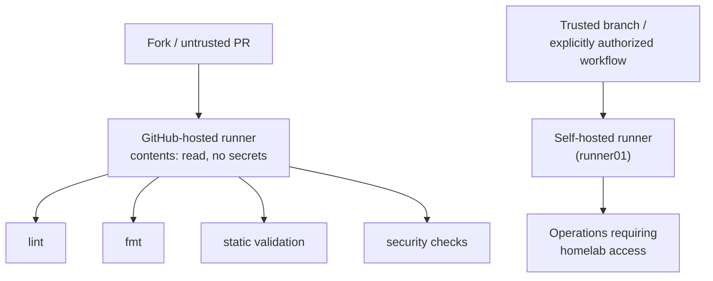

# Self-Hosted Runner Trust Boundary

**Status: design only.** No self-hosted runner is configured yet — see
[`STATUS.md`](../../STATUS.md). This document defines the security model
that must be in place *before* one is. Do not stand up `runner01` by
following this doc alone; it intentionally excludes step-by-step setup.

## Why this matters

This repository will (eventually) use a GitHub Actions self-hosted runner
inside the private homelab so CI can reach real infrastructure. A
self-hosted runner in a public repository is privileged infrastructure: any
workflow that reaches it can, in principle, do anything that runner's
credentials allow, inside the actual home network. Untrusted code (a public
PR) reaching it is treated as equivalent to giving a stranger a shell
inside the homelab.

## Trust boundary



**Rule:** untrusted pull-request code never automatically executes on a
privileged self-hosted runner with homelab access. Public PR validation
(lint, fmt, static validation, security scanning) always targets a
GitHub-hosted runner. Only a trusted branch (e.g. `main`, post-review) or a
manually dispatched, explicitly authorized workflow may target
`self-hosted`.

## Runner placement and hardening (design)

- **Never** installed on the Proxmox host itself — a compromised runner
  must not have a path to the hypervisor by default.
- Dedicated `runner01` VM, isolated from `cp01`/`worker01`/`worker02` by
  network segmentation appropriate to what that runner's jobs actually need.
- Runner process runs as a **non-root** dedicated account with minimal,
  explicitly scoped `sudo` — not full sudo.
- Minimal installed software — only what the runner's specific jobs require.
- No long-lived credentials stored in the runner's persistent workspace;
  credentials are injected per-job (GitHub Actions Secrets / short-lived
  tokens) and not left on disk between runs.
- Workspace cleaned between jobs.
- Target state: **ephemeral runners** (fresh VM or container per job) once
  the base pattern is proven — reduces the blast radius of any single
  compromised job to "this one job," not "this runner, forever."
- Regular OS patching; runner software kept current.
- Runner GitHub token/PAT scoped to only what registering and running the
  runner requires — no broader repo or org permissions than necessary.

## Labels

Conceptual labels, assigned per runner capability, not applied broadly:

```text
self-hosted
linux
homelab
infra
```

A workflow requests the narrowest label set its job actually needs.
`runs-on: self-hosted` alone (with no further label) is not used — it's
too easy for an unrelated workflow to accidentally match a privileged
runner.

## Workflow trigger review

Every workflow trigger that could route to `self-hosted` is reviewed
individually for its trust implications, with particular attention to:

| Trigger | Risk | Rule here |
|---|---|---|
| `pull_request` | Runs with the PR's code, but a fork PR's `GITHUB_TOKEN` is read-only and secrets aren't exposed to fork PRs by default — still kept on GitHub-hosted runners for defense in depth | Never targets `self-hosted` |
| `pull_request_target` | Runs with the **base** repo's secrets/permissions even for fork PRs, while checking out PR code — a classic privilege-escalation trigger if it checks out and executes untrusted code | Not used unless a specific job requires it, reviewed individually, never combined with checking out and executing PR code |
| `workflow_run` | Can run after an untrusted workflow with elevated permissions | Reviewed individually before any use |
| `workflow_dispatch` | Manual, human-triggered | Acceptable path to `self-hosted` — it's an explicit, authenticated human action |
| Reusable workflows (`workflow_call`) | Inherit caller's permission context | Scoped `permissions:` reviewed at both call sites |

## GitHub Actions permissions

Default `permissions: contents: read` at the workflow level (see
[`../../.github/workflows/validate.yml`](../../.github/workflows/validate.yml)
and [`security.yml`](../../.github/workflows/security.yml)). Any job
needing more (e.g. `security-events: write` for SARIF upload) declares it
at the job level, not the workflow level.

## What's explicitly deferred

Actually provisioning `runner01`, registering it, and wiring any workflow
to `self-hosted` is out of scope for repository bootstrap — see the root
task instructions and [`STATUS.md`](../../STATUS.md#blocked). This document
is the design that setup must satisfy when it happens.
